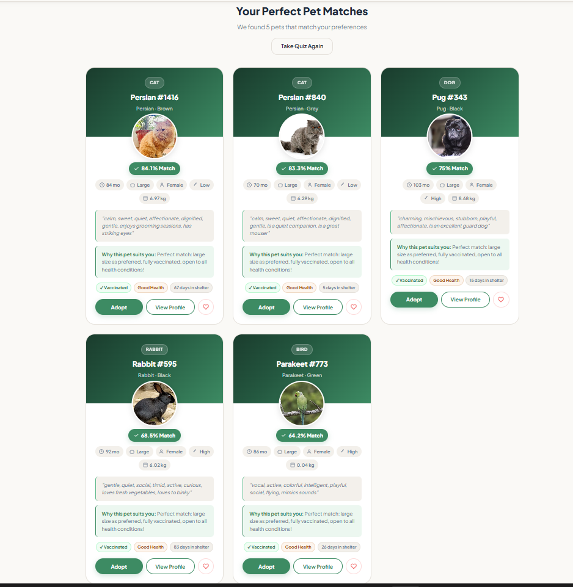
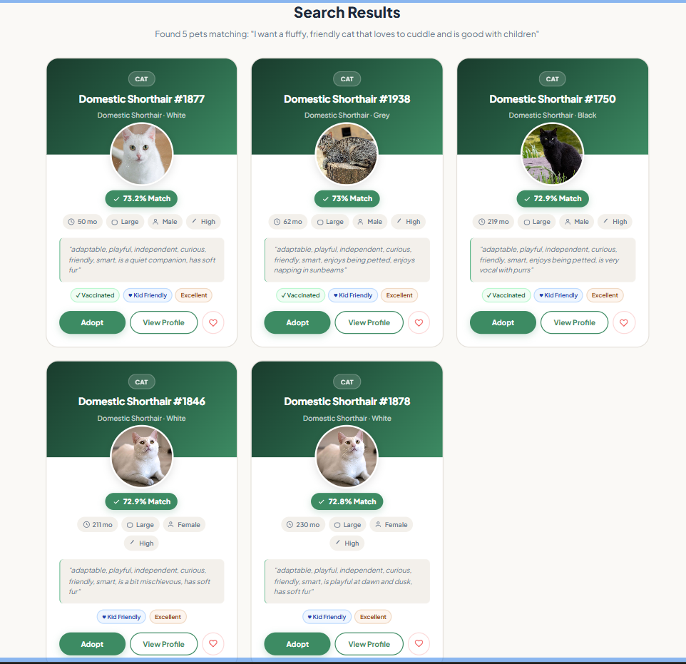
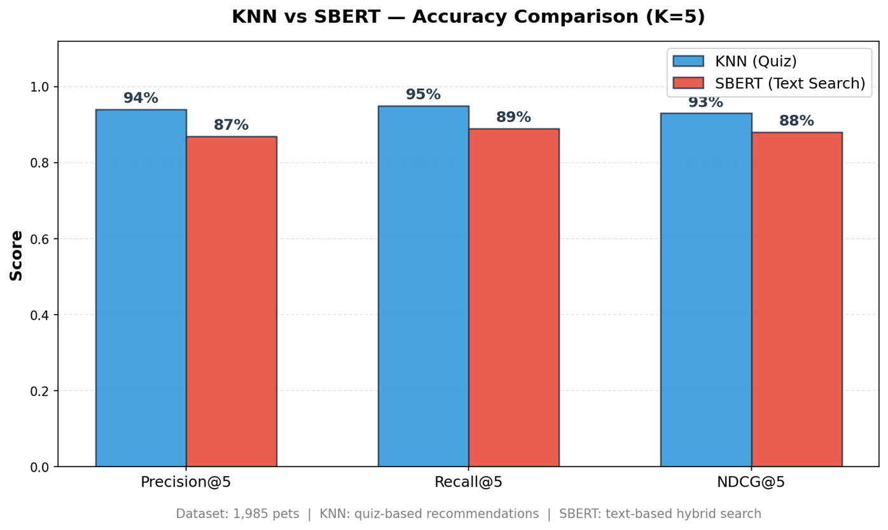
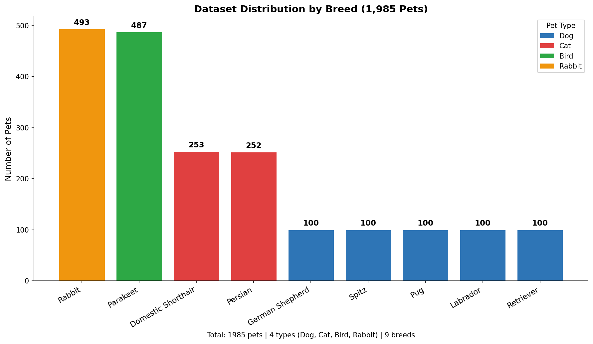
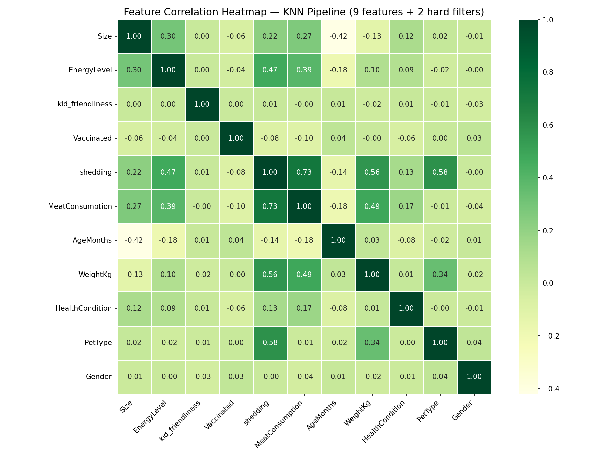

# Pet Recommendation System

A machine learning-powered pet recommendation system that matches users with suitable pets using two ML approaches — a structured quiz powered by **K-Nearest Neighbors (KNN)** and a natural language search powered by **Sentence-BERT (SBERT)**. Built as a full-stack web application with user authentication and an admin panel.


## Technology Stack

| Category | Technology |
|---|---|
| ML Models | Scikit-learn (KNN), Sentence-Transformers (SBERT), PyTorch |
| Data Processing | Pandas, NumPy |
| Web Framework | Flask, Flask-SQLAlchemy, Flask-Login |
| Database | SQLite |
| Frontend | HTML, CSS, JavaScript |


## Recommendation Approaches

### 1. KNN — Quiz-Based Recommendations

Users answer lifestyle questions which are converted into a 9-dimensional feature vector. KNN finds the nearest matching pets using Euclidean distance with distance-weighted scoring.

**Hard constraints applied before ranking:**
- Meat diet preference
- Preferred pet type
- Gender preference

**Type-diversity:** Results guarantee the best match from each eligible pet type to prevent dataset distribution skew from dominating results.

Optimal K=5 was selected using the elbow method on validation RMSE.



### 2. SBERT — Natural Language Search

Users describe their ideal pet in plain text. The input is embedded using the `all-MiniLM-L6-v2` Sentence-BERT model and ranked against pre-computed pet embeddings using cosine similarity, combined with keyword matching for improved accuracy.



### Model Performance Comparison



| Metric | KNN (Quiz) | SBERT (Text Search) |
|---|---|---|
| Precision@5 | 94% | 87% |
| Recall@5 | 95% | 89% |
| NDCG@5 | 93% | 88% |


## Dataset

1,985 pets across 4 types and 9 breeds:

| Pet Type | Count |
|---|---|
| Dogs | 500 |
| Cats | 505 |
| Birds | 487 |
| Rabbits | 493 |

**Breeds:** Domestic Shorthair, Persian, German Shepherd, Retriever, Labrador, Pug, Spitz, Parakeet, Rabbit

**KNN Features:** Size, Energy Level, Kid-Friendliness, Vaccination Status, Shedding Level, Meat Diet, Age, Weight, Health Condition

### Breed Distribution



### Feature Correlation Heatmap




## System Architecture

```
User Input
    |
    |--- Quiz Answers -----> Feature Vector --> KNN Model --> Top K Pets
    |                                           (Euclidean Distance + Hard Filters)
    |
    |--- Text Description -> SBERT Embedding -> Cosine Similarity --> Ranked Pets
                             (all-MiniLM-L6-v2)

Results --> Confidence Score --> Web Interface --> Adoption Request
```


## Project Structure

```
Pet-Recommendation-System/
├── app_complete.py                # Flask web application (entry point)
├── database.py                    # SQLAlchemy models
├── pet_image_mapper.py            # Deterministic pet-to-image mapping
├── setup_admin.py                 # Admin user management CLI
├── requirements.txt
│
├── backend/
│   ├── recommendation_engine.py   # KNN + SBERT inference with filtering
│   └── enhanced_training.py       # Model training pipeline
│
├── frontend/                      # HTML/CSS/JS pages (no build step)
│   ├── index.html                 # Landing page
│   ├── quiz.html                  # KNN quiz interface
│   ├── search.html                # SBERT text search
│   ├── browse.html                # Pet listing with filters
│   ├── dashboard.html             # User dashboard
│   ├── admin-dashboard.html       # Admin panel
│   └── ...
│
├── model/                         # Trained model artifacts (auto-generated)
│
├── dataset/                       # Training CSV files
│
├── petimage/                      # Pet images for display
│
└── evaluation_results/            # ML evaluation charts
```


## Installation and Setup

### 1. Clone the repository

```bash
git clone https://github.com/Shilu-Poudel/Pet-Recommendation-System.git
cd Pet-Recommendation-System
```

If you already have the repo cloned, pull the latest changes:

```bash
git pull origin main
```

### 2. Create a virtual environment

```bash
python -m venv venv
```

Activate it:

- **Linux / macOS:**
  ```bash
  source venv/bin/activate
  ```
- **Windows (Command Prompt):**
  ```cmd
  source venv\Scripts\activate
  ```
- **Windows (PowerShell):**
  ```powershell
  source venv\Scripts\Activate.ps1
  ```

### 3. Install dependencies

```bash
pip install -r requirements.txt
```

### 4. Set up environment variables

Create a `.env` file in the root directory:

```
SECRET_KEY=your_secret_key_here
MAIL_SERVER=smtp.gmail.com
MAIL_PORT=587
MAIL_USERNAME=your_email@gmail.com
MAIL_PASSWORD=your_app_password
```

### 5. Train the models

Place the dataset CSV files in the `dataset/` folder, then run:

```bash
python backend/enhanced_training.py
```

This trains the KNN model, generates SBERT embeddings, and saves all artifacts to the `model/` directory.

### 6. Run the application

```bash
python app_complete.py
```

The application will be available at `http://localhost:5000`.

> **Note:** The SQLite database is created automatically on first run — no manual database setup is required.

### 7. Create an admin user (optional)

```bash
python setup_admin.py create
```


## Features

### User
- Register and login with email verification
- Quiz-based pet recommendations (KNN)
- Natural language text search (SBERT)
- Browse and filter all available pets
- Save favorites and submit adoption requests
- Personal dashboard to track adoption status

### Admin
- Dashboard with system statistics
- Add, edit, delete, and hide pets
- Manage users and adoption requests
- Approve or reject adoptions with contact details


## API Endpoints

### Recommendations
| Method | Endpoint | Description |
|---|---|---|
| POST | `/api/recommend/quiz` | KNN quiz-based recommendations |
| POST | `/api/recommend/text` | SBERT text search recommendations |

### Pets
| Method | Endpoint | Description |
|---|---|---|
| GET | `/api/pets` | Get all pets with optional filters |
| GET | `/api/pets/<id>` | Get a specific pet |
| GET | `/api/stats` | Dataset statistics |

### Authentication
| Method | Endpoint | Description |
|---|---|---|
| POST | `/api/register` | Register new user |
| POST | `/api/login` | Login |
| POST | `/api/forgot-password` | Send password reset email |
| POST | `/api/reset-password` | Reset password with token |

### Adoption
| Method | Endpoint | Description |
|---|---|---|
| POST | `/api/adopt` | Submit adoption request |
| GET | `/api/adoptions/my` | Get current user's adoption requests |


## License

This project is for educational purposes.
